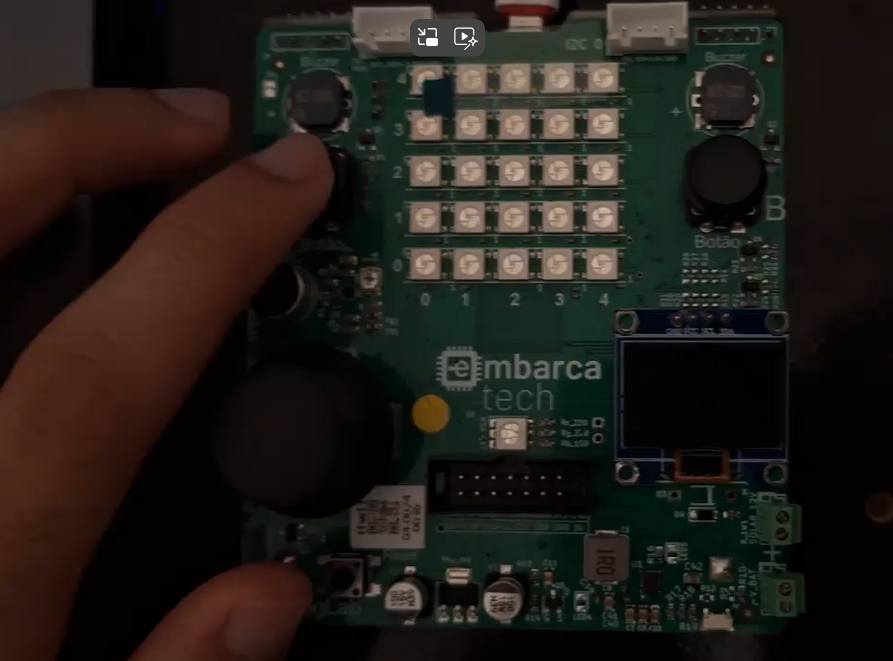

# EmbarcaTech_Unidade4_Clock_Temporizadores_1.

  

## Atividade: Temporizador de um disparo (One Shot)

## Descrição do Projeto

Este projeto tem como objetivo implementar um sistema de temporização utilizando a função add_alarm_in_ms() presente na ferramenta Pico SDK. O sistema deve acionar LEDs a partir do clique em um botão (pushbutton), seguindo um esquema de transição entre os estados dos LEDs com um temporizador de um disparo (one shot).

## Componentes Utilizados

- **Microcontrolador Raspberry Pi Pico W (RP2040)**: Responsável pelo controle dos pinos GPIO.
- **LED RGB**: Com os pinos conectados às GPIOs 11, 12 e 13.
- **03 Resistores de 330 Ω**: Para limitação de corrente nos LEDs.
- **LED RGB**: Utilizado para reproduzir o funcionamento do semáforo via GPIOs 11, 12 e 13 na placa BitDogLab.
- **Botão (Pushbutton)**: Conectado na GPIO 5, tem a função de acionar os LEDs.

## Ambiente de Desenvolvimento

- **VS Code**: Ambiente de desenvolvimento utilizado para escrever e debugar o código.
- **Linguagem C**: Linguagem de programação utilizada no desenvolvimento do projeto.
- **Pico SDK**: Kit de Desenvolvimento de Software utilizado para programar a placa Raspberry Pi Pico W.
- **Simulador Wokwi**: Ferramenta de simulação utilizada para testar o projeto.

## Guia de Instalação

1. Clone o repositório:
2. Importe o projeto utilizando a extensão da Raspberry Pi.
3. Compile o código utilizando a extensão da Raspberry Pi.
4. Caso queira executar na placa BitDogLab, insira o UF2 na placa em modo bootsel.
5. Para a simulação, basta executar pela extensão no ambiente integrado do VSCode.

## Guia de Uso

Pressione o botão para iniciar a sequência de acionamento dos LEDs.

Os LEDs serão desligados progressivamente a cada 3 segundos.

Enquanto os LEDs estiverem no processo de desligamento, o botão não poderá iniciar um novo ciclo.

No experimento com a BitDogLab, os LEDs RGB nas GPIOs 11, 12 e 13 reproduzem o comportamento dos LEDs individuais.
A cor branca é quando os 3 LEDs estão acesos e a cor Magenta é quando 2 LEDs estão acesos.

## Testes

Testes básicos foram implementados para garantir que cada componente está funcionando corretamente. 

## Desenvolvedor

[Lucas Gabriel Ferreira](https://github.com/usuario-lider)

## Vídeo da Solução

Clique na imagem abaixo para assistir ao vídeo que demonstra a solução trabalhada e os resultados obtidos nos experimentos:

  

